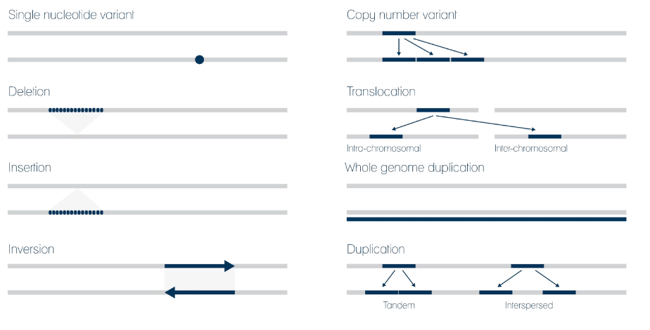

# Genome_Informatics_project
In this repo are stored calculation scripts used as part of project for Genomics Informatics course.

snp_metrics.ipynb is currently our finall script. Other two are similiar and they are represent previous versions of our final script.

###### Here is info about project:

## Comparison of GATK HaplotypeCaller and Freebayes Variant Calling tools

### Table of content

* [Task](###Task)
* [Variant Calling](###Variant-Calling)
* [Tools](###Tools)
* [GATK](###GATK)
* [Freebayes](###Freebayes)
* [Generated VCF files](###Generated-VCF-files)
* [Manual calculation  of metrics](###Manual-calculation-of-metrics)
* [Comparison of  metrics calculated by different tools](###Comparison-of-metrics-calculated-by-different-tools)
* [Graphs](###Graphs)
* [Conclusion](###Conclusion)

### Task

* Objective of our project was to perform Variant calling on provided BAM file and using human genome as reference genome (fasta file) by using GATK 4 Haplotype Caller and Free Bayes variant calling tools.

* 2nd tasks was to compare output files from previous step taking Halpotype Caller as truth set and Freebayes as test set and getting out various metrics from that comparison like True positives, False positivises, False negatives and also calculate precision recall and F-score metrics. 

### Variant-Calling

  Before we start with our project, let’s first go through some basics we needed for this project. 
  Variant calling is the process of finding differences between reference genome and observed sample.  
  Variant Calling is usually final phase of DNA analysis  
  There are number of different genomic variants  
  Single nucleotide variant  
  Deletion  
  Insertion  
  Inversion  
  Copy number variant   
  Translocation   
  Whole genome duplication   
  Duplication (tandem or interspersed)   
  
  
   

  
  Different genomic variants can have different impact on human cells and organism
  SNV – Single nucleotide variant (simple alternation of single nucleotide but it can cause phenotype
  Based on variant location we can predict if mutation will have impact

### Tools
* ### GATK
  GATK 4 is very large tool and it is able to preform many different tasks.                                                                                     In our solution we use only small subset of it which name is, as you can guess HaplotypeCaller.  

  Prerequisite for using this tool is to have installed java-jdk and corresponding python and R libraries.   Fortunately there is more convenient way to   achieve this by using official Docker image, so this was our choice.  We also used Seven Bridges platform in order to make app for our task. It is worth to note that there already was existing GTAK app on platform but it has much earlier release date and it is deprecated for our needs.​

* ### Freebayes
  Frebayes is much smaller tool compare to GTAK and is specialized for finding small polymorphismsand.   Best thing is that it comes with pre built x64 bit     linux    library, so we don't need to install anything.  

  Again, here we can see RUN command with -f switch we state needed files and after grater mark we put name of output file. var.vcf in this case.
### Generated-VCF-files
### Manual-calculation-of-metrics
### Comparison-of-metrics-calculated-by-different-tools
### Conclusion
